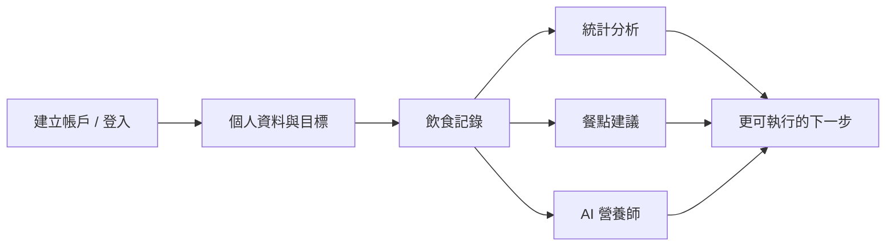

<div align="center">


# 營養管理系統

**飲食記錄 · AI 營養師 · 熱量與營養統計**

[立即體驗線上版本](http://nutrition.cong-ren.com/) · [登入](http://nutrition.cong-ren.com/login)

</div>

---

把「記錄、分析、諮詢」放在同一個地方——登入後即可跨裝置同步每日飲食，用圖表看懂熱量與營養趨勢，並透過 AI 取得餐點建議與營養對話，讓健康管理少一些猜測、多一些依據。

## 為什麼選擇這個平台？

| 你可能遇到的狀況 | 這裡怎麼幫你 |
|------------------|--------------|
| 每天吃了什麼很難回溯 | 結構化 **飲食記錄**，方便補登與查閱 |
| 只看總熱量不夠安心 | **營養分析與統計**，用週／月視角掌握變化 |
| 想知道「接下來該怎麼吃」 | **餐點建議** 與 **AI 營養師** 對話，輔助規劃 |

---

## 產品體驗一覽



- **智慧營養管理平台**：公開首頁即可了解產品定位；登入後開啟完整功能。
- **紀錄安全**：個人帳號保存資料，跨裝置查看。
- **即時統計**：從趨勢掌握熱量與營養攝取。
- **AI 協助**：營養相關問題與餐點靈感，一站取得。

> **立刻試用：** [http://nutrition.cong-ren.com/](http://nutrition.cong-ren.com/)

---

## 技術概要（開發者速覽）

本專案為 **React（Vite）全端應用**：前端使用 TypeScript、Redux Toolkit、TanStack Query、Tailwind CSS、React Hook Form、Zod、Recharts；後端為 **Express + TypeScript**，資料層 **PostgreSQL + Prisma**，身分驗證 **JWT**，並整合 **OpenAI** 提供 AI 能力。

---

## 功能特色

- 使用者認證（JWT）
- 個人營養需求（TDEE / BMR 等）
- 飲食記錄 CRUD
- 營養素分析與圖表
- AI 餐點建議
- AI 營養諮詢

---

## 專案結構

```
Ren_React_Project/
├── frontend/     # React 前端（Vite）
├── backend/      # Express API
└── docs/         # 專案文件
```

---

## 快速開始

### 前置需求

- Node.js 18+
- PostgreSQL 15+
- npm 或 yarn

### 後端

```bash
cd backend
npm install
cp .env.example .env   # 設定環境變數
npm run prisma:migrate
npm run dev
```

### 前端

```bash
cd frontend
npm install
cp .env.example .env   # 設定環境變數
npm run dev
```

---

## 文件

- [後端 API 說明](backend/README.md)
- [SEO 優化規劃](docs/SEO優化規劃.md)

---

## 部署參考

- **前端**：例如 [Vercel](https://vercel.com)、[Netlify](https://netlify.com)
- **後端**：例如 [Railway](https://railway.app)、[Render](https://render.com)

---

## 授權

MIT License
